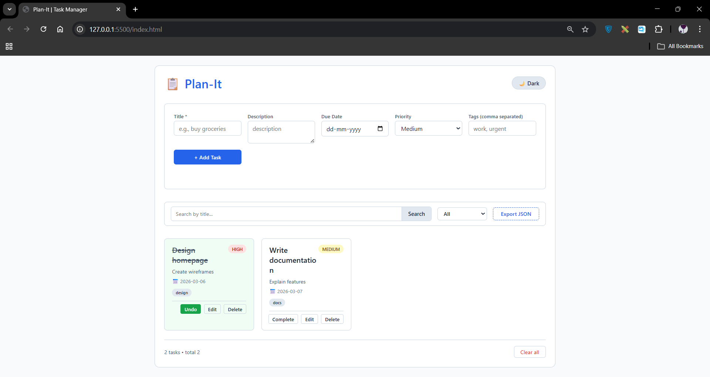
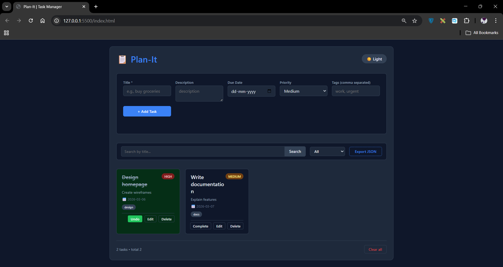

# PlanIt Task Manager

A clean, fully responsive task management web application built with HTML, CSS, and JavaScript. PlanIt helps you organize your daily tasks with features like adding, editing, deleting, searching, filtering, and even dragging to reorder. All data is saved in your browser's local storage, so your tasks persist even after refreshing the page.

## Features

- Create, Read, Update, Delete tasks
- Mark tasks as complete / pending
- Due date validation – prevents past dates
- Duplicate title prevention (case‑insensitive)
- Search by task title
- Filter by All / Completed / Pending
- Priority (Low, Medium, High) with color coding
- Tags – add custom labels to tasks
- Dark mode toggle (saves user preference)
- Drag and drop to reorder tasks
- Export all tasks as a JSON file
- Clear all tasks with confirmation
- Fully responsive – works on mobile, tablet, and desktop
- Data persisted via localStorage
- XSS safe – user input is sanitized

## Technologies Used

- HTML5 (semantic tags)
- CSS3 (Flexbox/Grid, custom properties for theming)
- JavaScript (ES6+)
- LocalStorage API
- No external frameworks or libraries

## Folder Structure

```
PlanIt-TaskManager/
│
├── index.html         # Main HTML file
├── style.css          # All styles (light/dark theme, responsive)
├── script.js          # Complete JavaScript logic
└── README.md          # Project documentation
```

## Getting Started

1. Download or clone the repository.
2. Place all three files (`index.html`, `style.css`, `script.js`) in the same folder.
3. Open `index.html` in any modern web browser (Chrome, Firefox, Edge, Safari).
4. Start managing your tasks!

No build tools or server required – it runs entirely in the browser.

## How to Use

- **Add a task**: Fill in the title (required), description, due date, priority, and optional tags. Click **"Add Task"**.
- **Edit a task**: Click the **"Edit"** button on any task card – the form will be populated for you to update. Then click **"Update Task"**.
- **Complete a task**: Click the **"Complete"** button (or **"Undo"** if already completed).
- **Delete a task**: Click the **"Delete"** button.
- **Search**: Type in the search box to filter tasks by title.
- **Filter**: Use the dropdown to show All, Completed, or Pending tasks.
- **Reorder**: Drag and drop any task card to a new position.
- **Dark mode**: Click the **"Dark"** / **"Light"** button in the header.
- **Export**: Click **"Export JSON"** to download all tasks as a `.json` file.
- **Clear all**: Click **"Clear all"** at the bottom (confirmation required).

## Bonus Features Implemented

- Dark Mode toggle
- Drag and Drop task reordering
- Task category tagging (via tags input)
- Export tasks to JSON file

## Responsive Design

The layout adapts seamlessly to different screen sizes:
- **Desktop**: Multi‑column grid, horizontal filter bar
- **Tablet**: Adjusted spacing and form layout
- **Mobile**: Stacked form, full‑width controls, single column tasks

## Screenshots

  
*Light Mode*

  
*Dark Mode*

## License

This project is free to use for educational purposes.

## Acknowledgements

Built as a complete implementation of the HTML/CSS/JS Task Manager project – includes all core requirements plus optional bonus features.

---

Happy planning!
```
